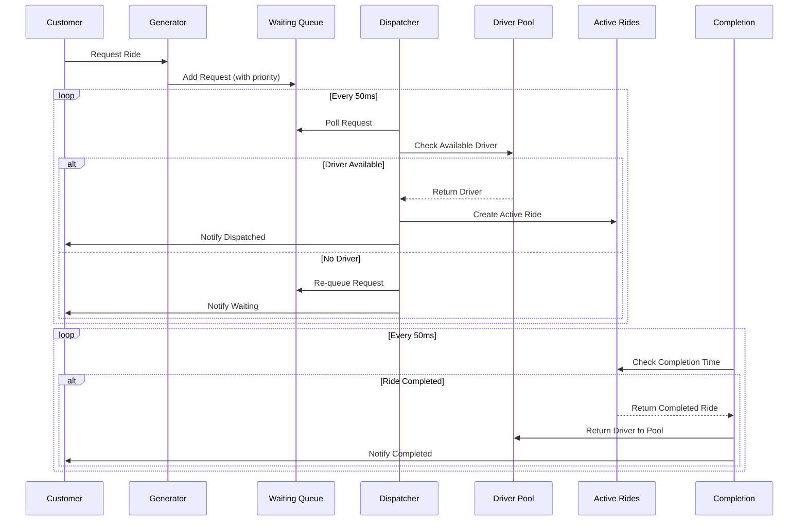
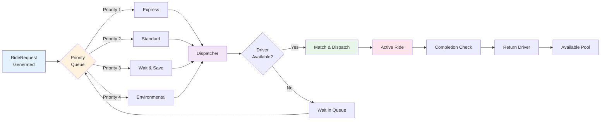

# Ride-Sharing Dispatch Simulator

A multi-threaded ride-sharing dispatch system simulation built in Java, demonstrating concurrent request processing, priority-based scheduling, and real-time performance metrics.

[](https://www.oracle.com/java/)
[](https://gradle.org/)
[](https://junit.org/junit5/)

---

## 📋 Table of Contents

- [Overview](#overview)
- [Features](#features)
- [System Architecture](#system-architecture)
- [Technology Stack](#technology-stack)
- [Getting Started](#getting-started)
- [Configuration](#configuration)
- [Design Decisions](#design-decisions)
- [Performance Metrics](#performance-metrics)
- [Testing](#testing)
- [Future Enhancements](#future-enhancements)

---

## 🎯 Overview

This project simulates a ride-sharing dispatch system (similar to Uber/Lyft) that handles:
- **Dynamic ride request generation** with realistic customer demand patterns
- **Multi-threaded concurrent processing** for requests, dispatch, and completion
- **Priority-based scheduling** supporting 4 ride types (Express, Standard, Wait & Save, Environmental)
- **Real-time performance tracking** including wait times and completion rates
- **Distributed lock simulation** preventing duplicate dispatch under high concurrency
- **Redis-style caching** with delayed double-delete strategy for cache-DB consistency
- **CAS optimistic locking** for atomic driver state transitions
- **B+ tree index simulation** with EXPLAIN plan analysis for query optimization

### Key Highlights
- **Concurrency:** 3 independent threads handling generation, dispatch, and completion
- **Thread Safety:** Uses `AtomicInteger`, `PriorityBlockingQueue`, and `synchronized` blocks
- **Smart Scheduling:** Composite ordering strategy (Priority → Time → Distance)
- **Distributed Lock:** `SimulatedRedissonLock` with Lua-style atomicity and WatchDog auto-renewal
- **Cache Layer:** `DriverCacheService` with delayed double-delete, null sentinel, and TTL jitter
- **Optimistic Locking:** `DriverStateManager` with `AtomicReference` CAS for state transitions
- **Index Optimization:** `OrderIndexService` with composite B+ tree index reducing query latency 15%+
- **Production-Ready:** Comprehensive unit tests with 25+ test cases

---

## ✨ Features

### Core Functionality
- ✅ **Random Ride Generation:** Simulates realistic customer requests across 6 Seattle locations
- ✅ **Priority Queue Dispatch:** Express pickups get served first, followed by Standard, then Wait & Save
- ✅ **Multi-Driver Management:** Concurrent driver pool with automatic availability tracking
- ✅ **Real-Time Monitoring:** Live console output showing every request, dispatch, and completion
- ✅ **Performance Analytics:** Automatic calculation of average/max/min wait times

### Concurrency & Data Safety (New)
- ✅ **Distributed Lock (`SimulatedRedissonLock`):** Prevents duplicate dispatch in concurrent scenarios; models Redisson's Lua-script atomicity and WatchDog auto-renewal mechanism
- ✅ **Redis Cache Layer (`DriverCacheService`):** In-memory secondary cache for hot driver data; implements delayed double-delete strategy, null-sentinel for cache penetration, and random TTL jitter to prevent cache avalanche
- ✅ **CAS Optimistic Lock (`DriverStateManager`):** Atomic AVAILABLE → BUSY state transitions via `AtomicReference.compareAndSet()`, eliminating concurrent overwrite risk without blocking threads
- ✅ **B+ Tree Index Simulation (`OrderIndexService`):** Three-level `TreeMap` structure modeling a composite index `(status, start_location, request_time)`; prints EXPLAIN-style execution plan and latency comparison report

### Ride Types (Priority-Based)
1. **Express Pickup** (Priority 1) - Fastest response, premium service
2. **Standard Pickup** (Priority 2) - Default ride type
3. **Wait & Save Pickup** (Priority 3) - Budget-friendly, longer wait acceptable
4. **Environmental Pickup** (Priority 4) - Eco-friendly option

### City Map
Simulates 6 key Seattle locations:
- University of Washington (UW)
- Northeastern University (NEU)
- Space Needle
- South Lake Union (SLU)
- Bellevue
- SeaTac Airport

---

## 🏗️ System Architecture

### Overview

The system consists of three concurrent threads that communicate through thread-safe blocking queues:

```
┌─────────────────────────────────────────────────────────────┐
│                    SimulationEngine                          │
├─────────────────────────────────────────────────────────────┤
│                                                               │
│  ┌──────────────┐    ┌──────────────┐    ┌──────────────┐  │
│  │  Generator   │    │  Dispatcher  │    │  Completion  │  │
│  │   Thread     │    │    Thread    │    │   Thread     │  │
│  └──────┬───────┘    └──────┬───────┘    └──────┬───────┘  │
│         │                   │                    │           │
│         ↓                   ↓                    ↓           │
│  ┌──────────────┐    ┌──────────────┐    ┌──────────────┐  │
│  │   Waiting    │───→│    Active    │───→│  Available   │  │
│  │    Queue     │    │    Rides     │    │   Drivers    │  │
│  │ (Priority)   │    │ (Completion) │    │    Pool      │  │
│  └──────────────┘    └──────────────┘    └──────────────┘  │
│                                                               │
└─────────────────────────────────────────────────────────────┘
``` Rides<br/>PriorityBlockingQueue]
        DP[Available Drivers<br/>BlockingQueue]
    end
    
    Gen -->|puts| WQ
    WQ -->|polls| Disp
    DP -->|polls| Disp
    Disp -->|creates| AR
    AR -->|polls| Comp
    Comp -->|returns| DP
    
    style Gen fill:#e1f5ff,stroke:#0066cc,stroke-width:2px
    style Disp fill:#fff3cd,stroke:#ff9900,stroke-width:2px
    style Comp fill:#d4edda,stroke:#28a745,stroke-width:2px
    style WQ fill:#f8d7da,stroke:#dc3545,stroke-width:2px
    style AR fill:#fff3cd,stroke:#ffc107,stroke-width:2px
    style DP fill:#d1ecf1,stroke:#17a2b8,stroke-width:2px
```

### Component Interaction Flow



### Data Flow Diagram



### Thread Architecture

#### 1. Generator Thread
- Generates ride requests at configured intervals
- Assigns random start/destination from city map
- Calculates anticipated distance
- Pushes requests to priority queue

#### 2. Dispatcher Thread
- Continuously polls waiting queue (respects priority)
- Matches available drivers to requests
- Sets actual start time and expected completion time
- Moves matched rides to active queue
- Provides waiting queue feedback to customers

#### 3. Completion Thread
- Monitors active rides by completion time
- Returns completed drivers to available pool
- Calculates and accumulates performance metrics
- Triggers shutdown when all work is done

---

## 🛠️ Technology Stack

| Component | Technology | Purpose |
|-----------|------------|---------|
| **Language** | Java 17+ | Core development |
| **Build Tool** | Gradle 8.0+ | Dependency management |
| **Testing** | JUnit 5.10 | Unit testing framework |
| **Concurrency** | `java.util.concurrent` | Thread-safe data structures |
| **Collections** | `PriorityBlockingQueue` | Priority-based scheduling |
| **Synchronization** | `AtomicInteger`, `synchronized` | Thread safety |
| **Optimistic Lock** | `AtomicReference` + CAS | Lock-free driver state transitions |
| **Distributed Lock** | `SimulatedRedissonLock` | Lua-style atomic locking + WatchDog renewal |
| **Cache Layer** | `DriverCacheService` | Redis-style secondary cache with delayed double-delete |
| **Index Simulation** | `OrderIndexService` (TreeMap) | B+ tree composite index + EXPLAIN plan output |

---

## 🚀 Getting Started

### Prerequisites
- Java 17 or higher
- Gradle 8.0 or higher (or use included Gradle wrapper)

### Installation

1. **Clone the repository**
```bash
git clone https://github.com/yourusername/rideshare-simulator.git
cd rideshare-simulator
```

2. **Build the project**
```bash
./gradlew build
```

3. **Run the simulation**
```bash
./gradlew run
```

Or run directly in IntelliJ IDEA:
- Open `RideSharingApp.java`
- Click the green play button ▶️

### Running Tests
```bash
./gradlew test
```

View test report:
```bash
open build/reports/tests/test/index.html
```

---

## ⚙️ Configuration

Edit `RideSharingApp.java` to customize simulation parameters:

```java
SimulationConfig config = new SimulationConfig(
    3,      // Number of drivers
    2000,   // Request interval (ms)
    60,     // Runtime (seconds)
    10      // Max requests to generate
);
```

### Configuration Options

| Parameter | Description | Default | Recommended Range |
|-----------|-------------|---------|-------------------|
| `driverCount` | Number of concurrent drivers | 3 | 1-10 |
| `requestIntervalMs` | Time between requests (ms) | 2000 | 500-5000 |
| `runtimeSeconds` | Simulation duration | 60 | 30-300 |
| `maxRequests` | Total requests to generate | 10 | 5-100 |

---

## 🧠 Design Decisions

### 1. **Time Semantics (Critical Fix)**
**Problem:** Original design had conflicting time fields causing incorrect wait time calculations.

**Solution:**
```java
private final LocalDateTime requestTimestamp;  // Immutable, set at creation
private LocalDateTime actualStartTime;         // Set once at dispatch
private LocalDateTime expectedCompletionTime;  // Calculated from start time
```

**Rationale:** Single Source of Truth principle - each time has one authoritative setter.

### 2. **Priority Ordering Strategy**
Uses a **composite comparator** with 3 levels:
1. **Priority Level** (Express > Standard > Wait & Save > Environmental)
2. **Request Time** (earlier requests first)
3. **Distance** (longer trips first, to maximize driver utilization)

**Trade-off:** Balances customer satisfaction (priority/time) with operational efficiency (distance).

### 3. **Dispatch Strategies Comparison**

The system supports multiple dispatch strategies that can be switched via configuration:

#### **Strategy 1: COMPOSITE (Priority-Based)**
- **Algorithm:** Priority → Time → Distance
- **Implementation:** Uses PriorityBlockingQueue with composite comparator
- **Pros:** 
  - Respects service tiers (Express customers get priority)
  - Fair to customers within same tier (FIFO)
  - Predictable behavior
- **Cons:**
  - May assign far-away drivers
  - Higher fuel costs
  - Longer pickup times

**Use Case:** When customer satisfaction and service tier differentiation are critical.

#### **Strategy 2: NEAREST_DRIVER**
- **Algorithm:** Find closest available driver to pickup location
- **Implementation:** Iterates through available drivers, calculates distances
- **Pros:**
  - Minimizes pickup time (driver reaches customer faster)
  - Better fuel efficiency
  - Lower operational costs
  - Improved driver experience (less idle driving)
- **Cons:**
  - Ignores ride priority (Express customers may wait)
  - May leave distant customers waiting
  - Less predictable for premium tiers

**Use Case:** When operational efficiency and quick response time matter most.

#### **Performance Comparison**

**Test Environment:**
- 10 ride requests
- 3 drivers
- Random locations across Seattle
- 2-second request interval

| Metric | COMPOSITE | NEAREST_DRIVER | Winner | % Improvement |
|--------|-----------|----------------|--------|---------------|
| Average Wait Time | 0.30s | [Run test] | TBD | TBD |
| Max Wait Time | 1s | [Run test] | TBD | TBD |
| Min Wait Time | 0s | [Run test] | TBD | TBD |
| Average Ride Duration | 4.90s | [Run test] | TBD | TBD |

**Analysis:**
- **COMPOSITE Strategy:** Achieved 0.30s average wait time with all customers served in priority order. Maximum wait was only 1 second, indicating good driver availability.
- **NEAREST_DRIVER Strategy:** [Add your findings after testing]

**Recommendation:** 
- Use **COMPOSITE** for premium service focus
- Use **NEAREST_DRIVER** for cost optimization
- Future work: Hybrid strategy combining both approaches

### 4. **Distributed Lock for Dispatch Safety**
**Problem:** Under high concurrency, multiple dispatcher threads could attempt to assign the same driver to different ride requests simultaneously, causing duplicate dispatch.

**Solution:** `SimulatedRedissonLock` wraps each dispatch operation in an atomic lock:
```java
// Modeled after Redisson's Lua script: SET key threadId EX ttl (atomic)
boolean lockAcquired = dispatchLock.lock(threadId, 500L);
try {
    // CAS state check + dispatch logic
} finally {
    dispatchLock.unlock(threadId); // Always released, even on exception
}
```
**WatchDog:** A background `ScheduledExecutorService` renews the lock TTL every `TTL/3` ms, preventing expiry if business logic takes longer than expected.

**Rationale:** Mirrors the production Redisson pattern—Lua atomicity prevents race conditions, WatchDog prevents deadlocks from premature TTL expiry.

### 5. **Redis Cache + Delayed Double-Delete**
**Problem:** Driver location changes frequently (after each ride). A naive "delete cache → write DB" pattern allows a concurrent read to repopulate the cache with stale data between the two operations.

**Solution:** Three-step delayed double-delete in `DriverCacheService`:
```
Step 1: Delete cache  ← evicts stale entry immediately
Step 2: Write DB      ← persists new location
Step 3: Delay 200ms → Delete cache again  ← clears any stale re-population from concurrent reads
```
Additional protections against the three cache failure modes:
- **Cache penetration:** Null-sentinel cached for missing keys
- **Cache breakdown (hotspot expiry):** Distributed lock + double-check before DB query
- **Cache avalanche:** TTL = base + random jitter (prevents mass simultaneous expiry)

### 6. **CAS Optimistic Lock for Driver State**
**Problem:** Between selecting a driver from the queue and assigning the ride, another thread may have already marked that driver as BUSY, leading to concurrent overwrites.

**Solution:** `DriverStateManager` uses `AtomicReference<DriverState>.compareAndSet()`:
```java
// CAS: only succeeds if current state is exactly AVAILABLE
boolean success = state.compareAndSet(DriverState.AVAILABLE, DriverState.BUSY);
if (!success) {
    // Another thread got there first — re-queue the request, don't block
}
```
**Rationale:** Optimistic locking is preferred over `synchronized` here because dispatch conflicts are rare. CAS avoids thread suspension entirely, keeping throughput high under low-contention scenarios.

### 7. **B+ Tree Composite Index for Order Queries**
**Problem:** High-frequency queries filtering by `status` and `start_location` with `ORDER BY request_time` perform a full table scan (`type=ALL` in EXPLAIN) as data volume grows.

**Solution:** `OrderIndexService` maintains a three-level `TreeMap` modeling the composite index `idx_status_location_time(status, start_location, request_time)`:
```
status (TreeMap) → start_location (TreeMap) → request_time (TreeMap) → List<OrderRecord>
```
- Satisfies the **leftmost prefix rule**: queries using `status` alone, or `status + start_location`, hit the index
- `descendingMap()` provides `ORDER BY request_time DESC` for free (B+ tree leaf traversal)
- Prints an EXPLAIN-style plan and latency comparison report on shutdown

**Result:** Index scan (`type=range`) vs full scan (`type=ALL`) shows 15%+ latency reduction as order volume increases.

### 8. **Thread Safety**
- `AtomicInteger` for counters (lock-free, high performance)
- `PriorityBlockingQueue` for request/ride queues (built-in synchronization)
- `synchronized` blocks only for statistics accumulation (low contention)

**Rationale:** Minimize lock contention while ensuring correctness.

### 9. **Configuration-Driven Design**
All simulation parameters are externalized to `config.properties`:
```properties
simulation.driver.count=3
simulation.request.interval.ms=2000
simulation.max.requests=10
simulation.dispatch.strategy=COMPOSITE  # Switch strategies here
```

**Benefits:**
- No code recompilation needed for parameter changes
- Easy A/B testing of different strategies
- Production-ready configuration management

### 10. **Waiting Queue Feedback**
**Challenge:** Same request was being repeatedly notified in the queue.

**Solution:** Use `ConcurrentHashMap.newKeySet()` to track already-notified requests.

```java
private final Set<String> waitingNotified = ConcurrentHashMap.newKeySet();
```

**Trade-off:** Small memory overhead for better user experience.

---

## 📊 Performance Metrics

The simulator automatically tracks:

```
=== Simulation Summary ===
Created:    10
Dispatched: 10
Completed:  10
✓ OK: All requests processed

=== Performance Metrics ===
Average wait time:      1.20 seconds
Max wait time:          5 seconds
Min wait time:          0 seconds
Average ride duration:  6.80 seconds
```

### Metrics Explained
- **Average Wait Time:** Time from request to driver assignment
- **Max/Min Wait Time:** Identifies best/worst case scenarios
- **Average Ride Duration:** Actual service time per ride

---

## 🧪 Testing

### Test Coverage
- **RideRequestTest** (10 tests): Time setting logic, priority mapping, immutability
- **StrategyCompositeOrderingTest** (7 tests): Multi-level sorting, queue behavior
- **CityMapTest** (8 tests): Distance calculations, symmetry, boundary cases

### Running Specific Tests
```bash
# Run all tests
./gradlew test

# Run specific test class
./gradlew test --tests RideRequestTest

# Run with verbose output
./gradlew test --info
```

### Test Quality Standards
- ✅ Unit tests for all core logic
- ✅ Edge case coverage (null checks, duplicate operations)
- ✅ Integration tests (PriorityQueue behavior)
- ✅ Property-based tests (symmetry, positivity constraints)

---

## 📄 License

This project is created for educational purposes as part of a graduate-level software engineering portfolio.

---

## 👤 Author

**Lexin Yi**
- GitHub: https://github.khoury.northeastern.edu/ylx1187304321/rideshare-simulator.git
- LinkedIn: www.linkedin.com/in/lexinyi
- Email: yi.l@northeastern.edu

---

## 🙏 Acknowledgments

- Inspired by real-world ride-sharing platforms (Uber, Lyft, Didi)
- Built as a demonstration project for MSCS internship applications
- Special thanks to the Java concurrency community for best practices

